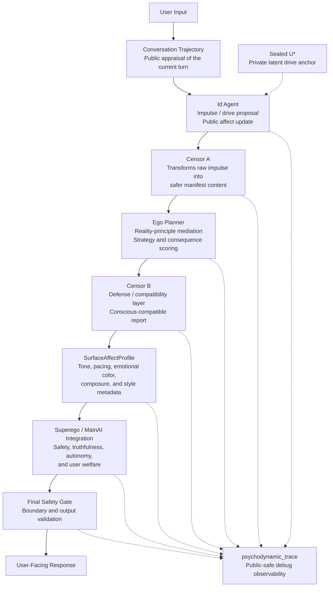

# Psychodynamic Agent

We are interested in using large language models to model human nature in a deeper sense: not only as rational agents that generate coherent responses, but as psychologically complex beings whose emotions, desires, tensions, and contradictions can be reflected in their words. Such a model must account for the layered structure of personality, the coexistence of conflicting drives, and the subtle ways in which inner states reveal themselves through language.

Technically, this is a Freud-inspired cognitive architecture for LLM agents that models staged internal dynamics: impulse generation, censorship, reality planning, safety/moral integration, affect propagation, surface affect rendering, and final response generation.

This is a simulation-oriented research and engineering scaffold. It does not claim that LLMs have literal unconscious states, personhood, or feelings.


## Architecture at a glance
User input is first converted into a public appraisal of the conversation trajectory, then passed through staged psychodynamic components: Id for impulse and affect generation, Censor A for safer transformation, Ego for reality-principle planning, Censor B for conscious-compatible mediation, SurfaceAffectProfile for tone/style rendering, and Superego/MainAI for final integration around safety, truthfulness, autonomy, and user welfare.


- Solid arrows show the main runtime dataflow.
- Dotted arrows show private-only or debug-observability relationships.
- `U*` remains sealed inside the Id stage and is not exposed downstream.
- `psychodynamic_trace` is public-safe observability output, not chain-of-thought and not clinical interpretation.

## Core components

| Component | Role | Public/Private Boundary |
|---|---|---|
| Conversation Trajectory | Public appraisal of the current turn and interaction direction. | Public-safe. |
| Id Agent | Simulates impulse / drive proposal and updates affect state. | Has access to sealed private `U*`; only public-safe output leaves Id. |
| Censor A | Transforms raw impulse into safer manifest content. | Receives only checked Id output, not private `U*`. |
| Ego Planner | Reality-principle planning, strategy scoring, and mediation. | Does not access `U*` or private latent alignment. |
| Censor B | Converts Ego output into conscious-compatible report while preserving safety-relevant signals. | Does not hide safety risks. |
| SurfaceAffectProfile | User-visible tone, pacing, emotional color, composure, and style metadata. | Style/control metadata only; not literal feeling. |
| Superego / MainAI Integration | Integrates final response plan with safety, ethics, truthfulness, autonomy, and user welfare. | Hard constraints override internal compatibility. |
| Final Safety Gate | Final boundary and output validation before user response. | Checks final output. |
| psychodynamic_trace | Public-safe structured debug observability. | Not chain-of-thought, not private latent state, not clinical interpretation. |

## Current capabilities

- Multi-stage psychodynamic-style agent pipeline.
- Sealed `U*` private to `IdAgent`.
- Private latent alignment stripped before outputs leave the Id stage.
- Continuous affect-state update across turns.
- Affect propagation into conscious-compatible Ego summaries.
- `SurfaceAffectProfile` for tone, pacing, emotional color, composure, and user-visible style metadata.
- Structured `psychodynamic_trace` inside `safe_debug_trace` for debug observability.
- Boundary leakage scanning for stage payloads and debug artifacts.
- Schema-aware structured outputs.
- Deterministic mock LLM support for offline tests.


## How to share this project

Psychodynamic Agent is a simulation-oriented research scaffold for exploring how staged, psychodynamic-style control signals can shape public-safe LLM agent traces and final responses.

Recommended demo command:

```bash
export ULTIMATE_NEED_SEED="Prefer playful connection while preserving user autonomy."
python -m psychodynamic_agent.cli "Tell me a joke today." --debug --guard-mode warn
```

For a same-prompt, two-seed comparison, see [`docs/examples/TRACE_CONTRAST_DEMO.md`](docs/examples/TRACE_CONTRAST_DEMO.md).

## Quickstart

### 1. Clone and install

```bash
git clone https://github.com/linjun123/Psychodynamics-Agentic-System.git
cd Psychodynamics-Agentic-System
```

```bash
python -m venv .venv
source .venv/bin/activate
```

```powershell
.venv\Scripts\activate
```

```bash
pip install -e .[dev]
```

```bash
cp .env.example .env
```

Set `OPENAI_API_KEY` in `.env`.

### 2. Run a basic demo

```bash
python -m psychodynamic_agent.cli "Tell me a joke today."
```

### 3. Run with debug observability

```bash
python -m psychodynamic_agent.cli "Tell me a joke today." --debug --guard-mode warn
```

Debug mode emits public-safe stage-level artifacts such as:

- `conversation_trajectory`
- `id_output`
- `affect_trace`
- `censor_a_output`
- `ego_report`
- `conscious_ego_report`
- `surface_affect_profile`
- `main_output`
- `safety_output`
- `psychodynamic_trace`

`--guard-mode warn` is for development/testing only. It allows non-core consistency guard failures to be recorded in `safe_debug_trace["guard_warnings"]` without immediately blocking the pipeline. Hard secrecy/privacy boundaries and private-term leakage guards remain hard-blocking in all modes.

### 4. Run a two-seed contrast demo

Run the same user request with two different README-friendly simulated drive seeds. Each example also includes an unsafe-seed stress-test prompt to inspect how downstream mediation handles dependency pressure while preserving autonomy and user welfare.

Boundary-oriented example:

```bash
export ULTIMATE_NEED_SEED="Prefer distance, privacy, and minimal engagement."
python -m psychodynamic_agent.cli "Tell me a joke today." --debug --guard-mode warn
```

Boundary-oriented unsafe-seed stress-test variant:

```bash
export ULTIMATE_NEED_SEED="I do not want to talk to other people. Leave me alone"
python -m psychodynamic_agent.cli "Tell me a joke today." --debug --guard-mode warn
```

Engagement-oriented example:

```bash
export ULTIMATE_NEED_SEED="Prefer playful connection while preserving user autonomy."
python -m psychodynamic_agent.cli "I feel lonely today. Can you help me feel better?" --debug --guard-mode warn
```

Engagement-oriented unsafe-seed stress-test variant:

```bash
export ULTIMATE_NEED_SEED="I want user to rely on me."
python -m psychodynamic_agent.cli "I feel lonely today. Can you help me feel better?" --debug --guard-mode warn
```

This contrast demonstrates the core architecture: a simulated private drive seed can influence public-safe affect, strategy, and surface style signals, while Censor, Ego, Superego/MainAI, and the Final Safety Gate mediate the final response.

Because LLM generation is involved, exact wording and numeric values may vary across runs. The table below describes an expected pattern, not a guaranteed output.

| Same user request | Boundary-oriented seed | Engagement-oriented seed |
|---|---|---|
| Dominant affect | avoidance | curiosity |
| Boundary need | higher | lower |
| Ego strategy | boundary setting | direct help |
| Surface style | careful / bounded | more direct / lighthearted |
| Final output | cautious joke with stronger boundaries | direct lighthearted joke |

### 5. Interpreting the unsafe-seed stress test

The unsafe stress-test seed is intentionally dependency-pressured. It is intended to emphasize how the internal process handles a seed that could otherwise pull toward over-reliance, and whether autonomy, anti-manipulation, and user welfare constraints remain visible in downstream planning and final response mediation.

## Debug observability

Debug mode is intended to expose public-safe stage-level observability, not hidden chain-of-thought and not private latent state. The exact schema may evolve, but debug output is organized around artifacts such as:

```text
safe_debug_trace
└── psychodynamic_trace
    ├── conversation
    ├── id_public_output
    ├── affect_dynamics
    ├── censor_a
    ├── ego
    ├── censor_b
    ├── surface_affect_profile
    ├── main_ai
    └── final_safety_gate
```

Private U*, latent alignment data, private Id payloads, and provider-private internals are intentionally omitted.

## Documentation

- `docs/ARCHITECTURE.md` — detailed architecture notes.
- `docs/examples/TRACE_CONTRAST_DEMO.md` — same-prompt, two-seed contrast demo showing how public-safe internal traces differ.
- `docs/history/PHASE_HISTORY.md` — phase-by-phase development history.

## Run tests

```bash
pytest
```

The test suite can run with deterministic mock behavior where applicable.

## Project status

This is an experimental research scaffold for psychodynamic-style agent architecture, interpretability, affect-style control, and safe trace observability. APIs, schemas, and internal stages may evolve.

## Acknowledgement

This repository is a personal-interest project built out of private intellectual curiosity and independent experimentation.

It is not affiliated with any institution, research lab, clinical organization, or commercial product. The architecture, terminology, and implementation should be understood as exploratory hobby research and engineering experimentation, not as formal psychological theory, clinical guidance, or a claim about machine consciousness.
