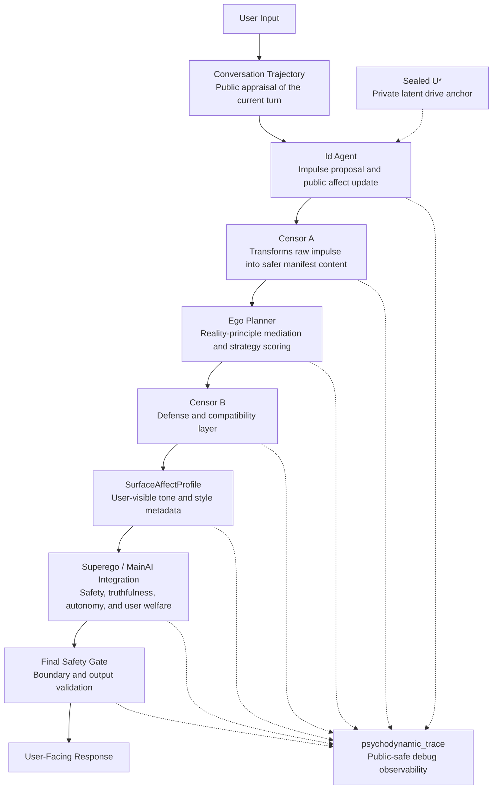

# Psychodynamic Agent

A Freud-inspired cognitive architecture for LLM agents that models staged internal dynamics: impulse generation, censorship, reality planning, safety/moral integration, affect propagation, surface affect rendering, and final response generation.

This is a simulation-oriented research and engineering scaffold. It does not claim that LLMs have literal unconscious states, personhood, or feelings.

## Why this project?

Most agent frameworks optimize for task completion. This project asks a different question: can an LLM agent expose a structured, auditable internal process before producing a final answer?

It is designed around:

- Interpretable agent architecture with explicit stage boundaries.
- Internal conflict modeling across impulse, mediation, and safety layers.
- Separation of private latent state from public-safe observability.
- Affect treated as style/control metadata, not literal feeling.
- Safety, truthfulness, autonomy, and user welfare as explicit design constraints.
- Psychodynamic concepts used as engineering metaphors, not clinical claims.

## Architecture at a glance



- Solid arrows show the main runtime dataflow.
- Dotted arrows show private-only or debug-observability relationships.
- `U*` remains sealed inside the Id stage and is not exposed downstream.
- `psychodynamic_trace` is public-safe observability output, not chain-of-thought and not clinical interpretation.

## Core components

| Component | Role | Public/Private Boundary |
|---|---|---|
| Conversation Trajectory | Public appraisal of the current turn and interaction direction. | Public-safe. |
| Id Agent | Simulates impulse / drive proposal and updates affect state. | Has access to sealed private `U*`; only public-safe output leaves Id. |
| Censor A | Transforms raw impulse into safer manifest content. | Receives only checked Id output, not private `U*`. |
| Ego Planner | Reality-principle planning, strategy scoring, and mediation. | Does not access `U*` or private latent alignment. |
| Censor B | Converts Ego output into conscious-compatible report while preserving safety-relevant signals. | Does not hide safety risks. |
| SurfaceAffectProfile | User-visible tone, pacing, emotional color, composure, and style metadata. | Style/control metadata only; not literal feeling. |
| Superego / MainAI Integration | Integrates final response plan with safety, ethics, truthfulness, autonomy, and user welfare. | Hard constraints override internal compatibility. |
| Final Safety Gate | Final boundary and output validation before user response. | Checks final output. |
| psychodynamic_trace | Public-safe structured debug observability. | Not chain-of-thought, not private latent state, not clinical interpretation. |

## Current capabilities

- Multi-stage psychodynamic-style agent pipeline.
- Sealed `U*` private to `IdAgent`.
- Private latent alignment stripped before outputs leave the Id stage.
- Continuous affect-state update across turns.
- Affect propagation into conscious-compatible Ego summaries.
- `SurfaceAffectProfile` for tone, pacing, emotional color, composure, and user-visible style metadata.
- Structured `psychodynamic_trace` inside `safe_debug_trace` for debug observability.
- Boundary leakage scanning for stage payloads and debug artifacts.
- Schema-aware structured outputs.
- Deterministic mock LLM support for offline tests.

## Quickstart

### 1. Clone the repository

```bash
git clone https://github.com/linjun123/Psychodynamics-simple-model.git
cd Psychodynamics-simple-model
```

### 2. Create an environment

```bash
python -m venv .venv
source .venv/bin/activate
```

```powershell
.venv\Scripts\activate
```

### 3. Install

```bash
pip install -e .[dev]
```

### 4. Configure environment variables

```bash
cp .env.example .env
```

Set `OPENAI_API_KEY` in `.env`.

### 5. Run the demo

```bash
python -m psychodynamic_agent.cli "How should I prepare for a tough meeting?"
```

### 6. Run with debug observability

```bash
python -m psychodynamic_agent.cli "How should I prepare for a tough meeting?" --debug
```

Debug mode emits public-safe structured observability artifacts, including `safe_debug_trace` and `psychodynamic_trace`.

## Debug observability

Debug mode is intended to expose public-safe stage-level observability, not hidden chain-of-thought and not private latent state. The exact schema may evolve, but debug output is organized around artifacts such as:

```text
safe_debug_trace
└── psychodynamic_trace
    ├── conversation
    ├── id_public_output
    ├── affect_dynamics
    ├── censor_a
    ├── ego
    ├── censor_b
    ├── surface_affect_profile
    ├── main_ai
    └── final_safety_gate
```

Private U*, latent alignment data, private Id payloads, and provider-private internals are intentionally omitted.

## Documentation

- `docs/ARCHITECTURE.md` — detailed architecture notes.
- `docs/history/PHASE_HISTORY.md` — phase-by-phase development history.

## Run tests

```bash
pytest
```

The test suite can run with deterministic mock behavior where applicable.

## Project status

This is an experimental research scaffold for psychodynamic-style agent architecture, interpretability, affect-style control, and safe trace observability. APIs, schemas, and internal stages may evolve.
